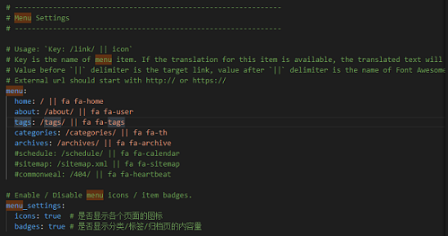

Hexo Next 主题默认带有不少菜单，如关于（about）、分类（categories）、标签（tags）等，默认处于注释状态，将需要取消的菜单注释掉，然后生成相应的 page 即可。

<!--more-->

1. 打开 `~\themes\next\_config.yml` 文件，找到 `menu` 相关的设置，取消掉需要的菜单项的注释。


2. 重新生成部署后，可以看到新增的菜单项，但是单击后会报如下错误
```
Cannot GET /about/
Cannot GET /tags/
Cannot GET /categories/
```

3. 这是因为还需要运行如下命令新建相关 page
```
hexo new page "about"
hexo new page "tags"
hexo new page "categories"
```
4. 新建 page 后，会在 source 目录下新建 `about`、`tags`、`categories`文件夹，每个文件夹下还会创建一个`index.md`文件表示关于、标签页分类页面，编辑这三个MarkDown文件可以自定义这三个页面的内容.

5. 最后一步，编辑各页面对应的`index.md`文件，增加 type 即可。注意冒号 : 后必须空一格，title 和 date 是默认生成的。重新部署后能够看到效果。
```
---
title: about
date: 2021-03-13 15:21:30
type: "about"
---
 
---
title: tages
date: 2021-03-13 15:21:30
type: "tags"
---
 
---
title: categories
date: 2021-03-13 15:21:30
type: "categories"
---
```
6. 在新建博文的头部，直接输入该博文的分类、标签等即可。分类只能有一个，标签能有多个，多个标签不能一行，注意下面的格式。
```
---
title: Hello World # 标题
date: 2019/3/26 hh:mm:ss # 时间
categories: # 分类
	- 分类  # 只能由一个
tags: # 标签
	- PS3  # 能有多个
	- Games  # 一个标签一行
---

摘要
<!--more-->
正文
```

- 参考
  - [Hexo博客NexT主题下添加分类、标签、关于菜单项](https://blog.csdn.net/mqdxiaoxiao/article/details/93644533)
  - [Hexo 官方文档](https://hexo.io/zh-cn/docs/front-matter)