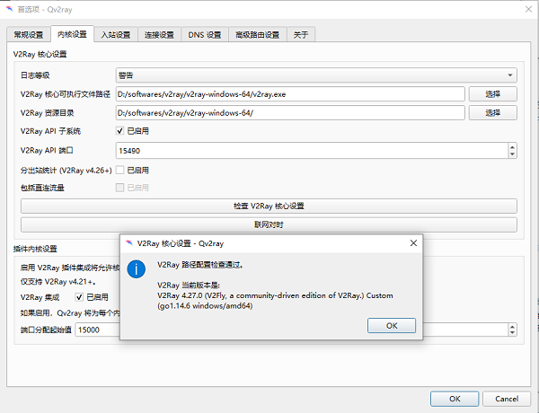
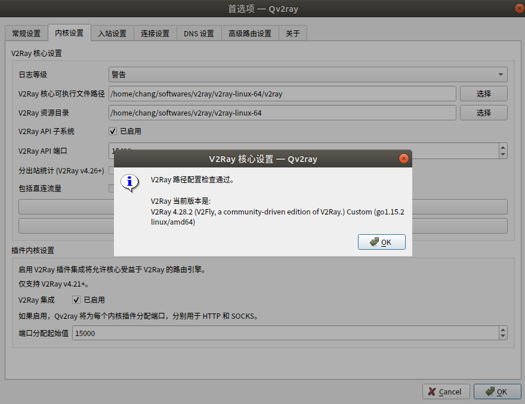

V2ray 是继 Shadowsocks(R) 后又一个体验很棒、功能非常强大的科学上网工具，近年来受到网友的广泛关注和喜爱。本教程详细介绍V2ray的安装和配置过程，让读者能迅速上手和使用V2ray。

<!--more-->

## windows

> 先创建安装 v2ray 的目录

1. 下载 QT 实现的 v2ray 界面。在官网链接上找到最新的 release 下载。
> https://github.com/Qv2ray/Qv2ray/releases 。

比如，我目前下载的是Qv2ray.v2.2.3.linux-x64.AppImage。
> [https://github.com/Qv2ray/Qv2ray/releases](https://github.com/Qv2ray/Qv2ray/releases)

2. 下载v2ray核心
> [https://github.com/v2ray/v2ray-core/releases](https://github.com/v2ray/v2ray-core/releases)

3. 解压v2ray核心文件

4. 执行 Qv2ray 客户端，选择首选项 -> 内核设置，修改下列两个路径
   - V2Ray 核心文件可执行**文件**路径：`.../v2ray-windows-64/wv2ray.exe`
   - V2Ray 资源**目录**：`.../v2ray-windows-64/`

5. 点击检查 V2Ray 核心设置，通过即可.
   

6. 返回 Qv2ray 主界面，选择：分组 -> 订阅设置，勾选此分组是一个订阅，再填写上自己的 v2ray 订阅地址，点击更新订阅 -> 确定（ok）

7. 配置成功 Qv2ray 主界面默认分组内会出现多条线路，并显示链路的个数。

## linux
> 可自建 v2ray 目录，也可直接将 v2ray core 放在 ~/.config/qv2ray/vcore/ 中，这是 Qvray 默认路径。

1. 下载QT实现的v2ray界面。在官网链接上找到最新的release下载。
> [https://github.com/Qv2ray/Qv2ray/releases](https://github.com/Qv2ray/Qv2ray/releases) 。

比如，我目前下载的是Qv2ray.v2.6.3.linux-x64.AppImage。

2. 下载v2ray core核心文件。打开官方网站：
> [https://github.com/v2ray/v2ray-core/releases/](https://github.com/v2ray/v2ray-core/releases/) 。

选择下载文件v2ray-linux-64.zip。

3. 进入 v2ray 下载的目录（我的是`~/v2ray`），执行下面命令给 Qv2ray 增加权限
```shell
sudo chmod +x ./Qv2ray.v2.6.3.linux-x64.AppImage  # 注意版本号
```

4. 启动 Qv2ray。仍然在v2ray根目录，执行下列终端命令
```shell
./Qv2ray.v2.6.3.linux-x64.AppImage
```

5. 解压 v2ray core 核心文件。
```
unzip v2ray-linux-64.zip
```

注意不要用 `sudo` 解压，用 `sudo` 解压须给 `v2ray-linux-64` 加权限，容易造成权限紊乱。

5. 在 Qv2ray 的首选项(Preference) 页面的内核设置（General Setting）中，设置v2ray核心文件的路径。

默认的路径是`~/.config/qv2ray/vcore/`。如果没有新建 v2ray 目录结构，可以将 v2ray-linux-64.zip 解压后的文件都放置到这个目录里面。

如果自建 v2ray 目录，选择自己的 V2Ray 核心可执行文件路径和 V2Ray 资源目录。

最后，可以点击Check V2ray Core Setting按钮，验证这两个可执行文件的有效性。
   

6. 返回 Qv2ray 主界面，选择：分组 -> 订阅设置，勾选此分组是一个订阅，再填写上自己的 v2ray 订阅地址，点击更新订阅 -> 确定（ok）
```
# 不可用
https://cloudfront-cdn-hk-iplc1.com/sub/v/wrvDgcKnw6nDncOAwrrCmMOOw5_CiH1-wqPCnMK1w4LCosOcw4B8wq1_w98k=/
```

- 在 Qv2ray 的首选项（Preferences）窗口中，可以设置语言、系统代理、开机启动等。

- 如果想仅仅在 Chrome 浏览器上做网络翻墙功能，就在 Chrome 浏览器上安装 Proxy SwitchyOmega 插件。在插件的配置页面上，设置Proxy Server，采用协议SOCK5，代理服务器是本地127.0.0.1，端口是1088（具体端口号查看 Qv2ray的 首选项（Preferences）。

- 如果不想做全局的系统代理 System Proxy，在Qv2ray的首选项中取消系统代理即可。

- Git 的代理需要另外配置。

## 参考
- 【Linux配置v2ray详细教程-Ubuntu为例】：[https://www.boluo.in/1776.htm](https://www.boluo.in/1776.html)l